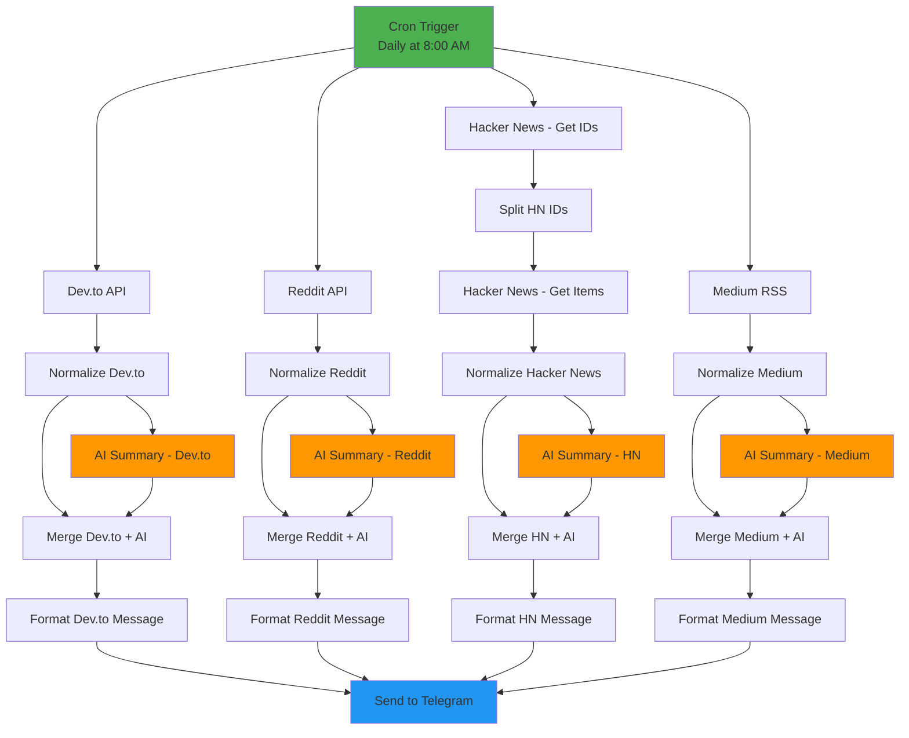
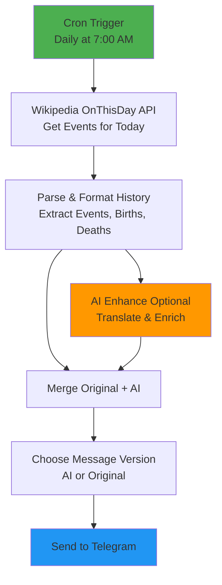

# n8n Workflows Collection

A collection of useful n8n workflows for automation, powered by Docker.

## 🚀 Features

- **Tech Daily Digest**: Automated daily digest from Dev.to, Reddit, Hacker News, and Medium with AI-powered summaries
- **Daily History Highlights**: "On This Day" historical events from Wikipedia with optional AI-enhanced Vietnamese translation
- **Daily Newsletter Aggregator**: Comprehensive newsletter aggregator with AI research and Notion knowledge base integration
- Self-hosted n8n instance with PostgreSQL database
- Easy setup with Docker Compose
- Secure configuration with environment variables

## 📋 Prerequisites

- Docker and Docker Compose installed
- ngrok account (for webhooks, optional)
- OpenAI API key (for AI summaries)
- Telegram Bot Token (for notifications)
- Notion API key (for knowledge base, optional)

## 🛠️ Setup

1. **Clone the repository**
   ```bash
   git clone <your-repo-url>
   cd n8n
   ```

2. **Create environment file**
   ```bash
   cp .env.example .env
   ```

3. **Configure environment variables**
   
   Edit `.env` file and update the following:
   - `WEBHOOK_URL` and `WEBHOOK_TUNNEL_URL`: Your ngrok or public URL
   - `POSTGRES_PASSWORD`: Strong database password
   - `N8N_BASIC_AUTH_USER` and `N8N_BASIC_AUTH_PASSWORD`: Your n8n login credentials
   - `TELEGRAM_CHAT_ID`: Your Telegram chat ID (for workflows)

4. **Start n8n**
   ```bash
   docker-compose up -d
   ```

5. **Access n8n**
   
   Open your browser and navigate to `http://localhost:5678`
   
   Login with the credentials you set in the `.env` file.

## 📂 Workflows

### 🔥 Tech Daily Digest

**File:** [`workflows/tech-daily-digest.json`](workflows/tech-daily-digest.json)

**Description:**  
Aggregates top tech articles from Dev.to, Reddit, Hacker News, and Medium with AI-powered Vietnamese summaries. Sends daily digest via Telegram at 8:00 AM.

**Features:**
- Fetches top 5 articles from multiple sources (Dev.to, Reddit r/programming, Hacker News, Medium)
- Generates AI-powered summaries in Vietnamese using OpenAI GPT-4o-mini
- Formats content with reactions, comments, and author information
- Delivers daily digest to Telegram at 8:00 AM (Asia/Ho_Chi_Minh timezone)

**Requirements:**
- OpenAI API credentials
- Telegram Bot Token
- Telegram Chat ID

**Setup:**
1. Import the workflow: Copy `workflows/tech-daily-digest.json` or import via n8n UI
2. Configure OpenAI credentials in n8n (Settings → Credentials → Add OpenAI)
3. Configure Telegram Bot credentials in n8n
4. Set `TELEGRAM_CHAT_ID` in your `.env` file
5. Activate the workflow

**Flow Diagram:**



---

### 📅 Daily History Highlights

**File:** [`workflows/daily-history-highlights.json`](workflows/daily-history-highlights.json)

**Description:**  
Delivers daily historical highlights from Wikipedia including major events, births, and deaths that occurred on this day in history. Features optional AI enhancement for Vietnamese translation and enrichment.

**Features:**
- Fetches "On This Day" events from Wikipedia API
- Shows top 5 historical events, 3 notable births, and 3 notable deaths
- Optional AI enhancement for Vietnamese translation and adding interesting insights
- Daily delivery via Telegram at 7:00 AM (Asia/Ho_Chi_Minh timezone)
- Includes Wikipedia links for detailed reading

**Requirements:**
- Telegram Bot Token
- Telegram Chat ID
- OpenAI API credentials (optional, for AI enhancement)

**Setup:**
1. Import the workflow: Copy `workflows/daily-history-highlights.json` or import via n8n UI
2. Configure Telegram Bot credentials in n8n
3. Set `TELEGRAM_CHAT_ID` in your `.env` file
4. (Optional) Configure OpenAI credentials for AI-enhanced translations
5. Activate the workflow

**Flow Diagram:**



---

### 📰 Daily Newsletter Aggregator

**File:** [`workflows/daily-newsletter-aggregator.json`](workflows/daily-newsletter-aggregator.json)

**Description:**  
Advanced newsletter aggregation system that fetches articles from multiple tech sources and delivers them via Telegram with interactive save buttons. Features on-demand AI research and Notion knowledge base integration for selected articles.

**Features:**
- **Multi-Source Aggregation**: Fetches from TechCrunch, The Verge, Hacker News, Dev.to, Stack Overflow Blog
- **Smart Filtering**: Only includes recent articles (24-72 hours depending on source)
- **Separate Messages**: Each article sent as individual Telegram message for better readability
- **Interactive Buttons**: "💾 Save to Notion" button on each article for selective saving
- **On-Demand AI Research**: Click button to trigger deep research only for articles you want
- **Notion Integration**: Saves researched articles to Notion database with comprehensive analysis
- **Instant Feedback**: Popup notification and button removal after clicking save
- **Deep AI Research** includes:
  - Detailed summary (3-4 paragraphs in Vietnamese)
  - Key takeaways (bullet points)
  - Context & background
  - Pros & cons analysis
  - Related technologies/concepts
  - Practical applications
  - Auto-generated tags (5-7 keywords)

**Requirements:**
- OpenAI API credentials
- Telegram Bot Token
- Telegram Chat ID
- Notion API credentials
- Notion Database ID

**Setup:**

1. **Create Notion Database**
   
   Create a new database in Notion with the following properties:
   - `Title` (title) - Auto-filled from article title
   - `URL` (url) - Link to original article
   - `Source` (select) - Article source (TechCrunch, The Verge, etc.)
   - `Tags` (multi-select) - AI-extracted tags
   - `Status` (select) - Set to "Researched" automatically
   - `Saved At` (date) - Timestamp when saved

2. **Get Notion Integration Token**
   - Go to https://www.notion.so/my-integrations
   - Create new integration
   - Copy the Internal Integration Token
   - Share your database with the integration

3. **Configure Environment Variables**
   
   Add to your `.env` file:
   ```env
   NOTION_DATABASE_ID=your_database_id_here
   TELEGRAM_CHAT_ID=your_telegram_chat_id
   ```

4. **Import Workflow**
   
   Import `workflows/daily-newsletter-aggregator.json` in n8n

5. **Configure Credentials**
   - OpenAI credentials in n8n (GPT-4o-mini)
   - Telegram Bot credentials in n8n
   - Notion API credentials in n8n (use your integration token)

6. **Activate Workflow**

**Usage:**

**Daily Digest (Automatic):**
- Runs every day at 9:00 AM (Asia/Ho_Chi_Minh)
- Fetches articles from 5 tech sources
- Sends separate Telegram message for each article
- Each message includes:
  - Source emoji and name
  - Article title
  - Brief description
  - Link to read more
  - "💾 Save to Notion" button

**Save Article with AI Research (Interactive):**
1. Click "💾 Save to Notion" button on any article
2. Receive instant popup: "✅ Saved! Processing with AI..."
3. Workflow automatically:
   - Parses article metadata from message
   - Fetches full article content
   - Performs deep AI research (GPT-4o-mini)
   - Extracts and sanitizes tags
   - Saves to Notion with all properties
   - Sends confirmation with Notion link
4. Button is removed to prevent duplicates

**Flow Diagram:**



```mermaid
graph TB
    subgraph "Daily Aggregation (9:00 AM)"
        A[Cron Trigger] --> B1[TechCrunch RSS]
        A --> B2[The Verge RSS]
        A --> B3[Hacker News API]
        A --> B4[Dev.to API]
        A --> B5[Stack Overflow Blog]
        
        B1 --> N1[Normalize TechCrunch]
        B2 --> N2[Normalize The Verge]
        B3 --> SP[Split HN IDs]
        SP --> GH[Get HN Items]
        GH --> N3[Normalize HN]
        B4 --> N4[Normalize Dev.to]
        B5 --> N5[Normalize Stack Overflow]
        
        N1 --> FM[Format Articles]
        N2 --> FM
        N3 --> FM
        N4 --> FM
        N5 --> FM
        
        FM --> ST[Send to Telegram<br/>with Save Button]
    end
    
    subgraph "On-Demand Research & Save (Button Click)"
        TB[Telegram Button Trigger] --> PC[Parse Button Callback<br/>Extract from Message Entities]
        PC --> AC[Answer Callback Query<br/>Show Popup]
        AC --> POD[Pass Original Data]
        AC --> FC[Fetch Article Content]
        FC --> AIR[AI Deep Research<br/>GPT-4o-mini 2000 tokens]
        AIR --> MG[Merge Content + Research]
        POD --> MG
        MG --> PN[Prepare for Notion<br/>Extract & Sanitize Tags]
        PN --> SN[Save to Notion Database<br/>with Properties]
        SN --> PCF[Prepare Confirmation<br/>Retrieve ChatId]
        PCF --> SC[Send Confirmation<br/>with Notion Link]
    end
    
    style A fill:#4CAF50
    style ST fill:#2196F3
    style SC fill:#2196F3
    style AIR fill:#FF9800
    style SN fill:#9C27B0
    style AC fill:#4CAF50
```

**Technical Details:**

**Sequential Flow for Callback Handling:**
The workflow uses a strict sequential flow to ensure Telegram callback queries are answered within the 5-second timeout:
1. Parse Button Callback (extracts data from message entities, not truncated callback_data)
2. Answer Callback Query (immediate response - prevents timeout errors)
3. Parallel processing:
   - Pass Original Data (preserves chatId, title, source for later nodes)
   - Fetch Article Content → AI Research → Merge → Save
4. Final confirmation with Notion link

**Data Extraction Strategy:**
- Uses `message.entities` (text_link, bold) instead of `callback_data` to avoid 64-character truncation
- Preserves full URLs and titles through workflow using `$('NodeName').first().json` syntax
- MarkdownV2 escaping for special characters in confirmation messages

**Error Handling:**
- Tags array validation and sanitization (handles undefined/null)
- Research content truncated to 2000 characters for Notion API limit
- Fallback tags: `['tech', 'research']` if extraction fails
- ChatId preservation through node references

**Example Notion Entry:**

When you save an article, it creates a Notion page like:

```
Title: Revolutionary AI Framework Announced
URL: https://techcrunch.com/article
Source: TechCrunch
Tags: AI, Framework, Machine Learning, Innovation, OpenSource
Status: Researched
Saved At: 2025-11-03T09:15:00.000Z

--- Content (First 2000 chars) ---

## Tóm tắt chi tiết

[3-4 đoạn phân tích chi tiết bằng tiếng Việt về bài viết]

## Key Takeaways

• Điểm chính thứ nhất
• Điểm chính thứ hai
• Điểm chính thứ ba

## Context & Background

[Giải thích tại sao bài viết này quan trọng và bối cảnh liên quan]

## Pros & Cons

**Ưu điểm:**
• Lợi ích 1
• Lợi ích 2

**Nhược điểm:**
• Hạn chế 1
• Hạn chế 2

## Related Technologies/Concepts

[Các công nghệ và khái niệm liên quan]

## Practical Applications

[Ứng dụng thực tế trong công việc và dự án]

## Tags

AI, Framework, Machine Learning, Innovation, OpenSource
```

---

## 🔧 Configuration

### Environment Variables

| Variable | Description | Default |
|----------|-------------|---------|
| `N8N_PORT` | n8n web interface port | `5678` |
| `N8N_PROTOCOL` | Protocol (http/https) | `http` |
| `WEBHOOK_URL` | Public webhook URL | - |
| `POSTGRES_USER` | Database username | `n8n` |
| `POSTGRES_PASSWORD` | Database password | - |
| `POSTGRES_DB` | Database name | `n8n` |
| `N8N_BASIC_AUTH_USER` | n8n admin username | `admin` |
| `N8N_BASIC_AUTH_PASSWORD` | n8n admin password | - |
| `TZ` | Timezone | `Asia/Ho_Chi_Minh` |
| `TELEGRAM_CHAT_ID` | Telegram chat ID for workflows | - |
| `NOTION_DATABASE_ID` | Notion database ID for newsletter saver | - |

## 📝 Adding Your Own Workflows

1. Create your workflow in the n8n UI
2. Export the workflow as JSON
3. Save it to the `workflows/` directory
4. The workflow will be automatically available on container restart

## 🛡️ Security Notes

- Never commit your `.env` file to version control
- Use strong passwords for database and n8n authentication
- Keep your OpenAI API keys and Telegram tokens secure
- Consider using HTTPS in production environments

## 🔄 Updating

```bash
docker-compose pull
docker-compose up -d
```

## 🛑 Stopping

```bash
docker-compose down
```

To remove all data including volumes:
```bash
docker-compose down -v
```

## 📖 Resources

- [n8n Documentation](https://docs.n8n.io/)
- [n8n Community](https://community.n8n.io/)
- [Docker Documentation](https://docs.docker.com/)

## 📄 License

MIT

## 🤝 Contributing

Contributions, issues, and feature requests are welcome!

---

Made with ❤️ for automation enthusiasts
