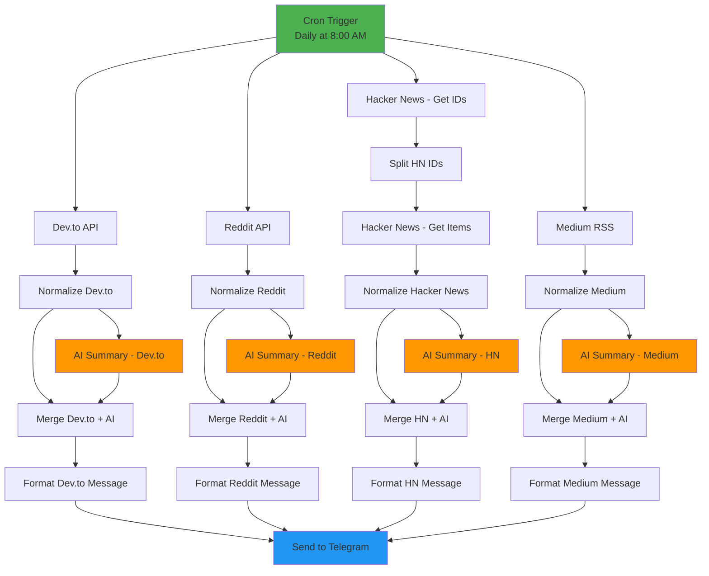
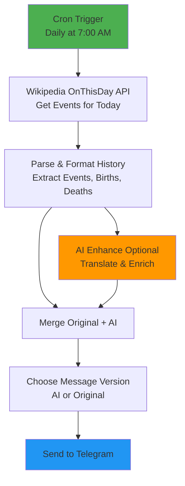

# n8n Workflows Collection

A collection of useful n8n workflows for automation, powered by Docker.

## 🚀 Features

- **Tech Daily Digest**: Automated daily digest from Dev.to, Reddit, Hacker News, and Medium with AI-powered summaries
- **Daily History Highlights**: "On This Day" historical events from Wikipedia with optional AI-enhanced Vietnamese translation
- Self-hosted n8n instance with PostgreSQL database
- Easy setup with Docker Compose
- Secure configuration with environment variables

## 📋 Prerequisites

- Docker and Docker Compose installed
- ngrok account (for webhooks, optional)
- OpenAI API key (for AI summaries)
- Telegram Bot Token (for notifications)

## 🛠️ Setup

1. **Clone the repository**
   ```bash
   git clone <your-repo-url>
   cd n8n
   ```

2. **Create environment file**
   ```bash
   cp .env.example .env
   ```

3. **Configure environment variables**
   
   Edit `.env` file and update the following:
   - `WEBHOOK_URL` and `WEBHOOK_TUNNEL_URL`: Your ngrok or public URL
   - `POSTGRES_PASSWORD`: Strong database password
   - `N8N_BASIC_AUTH_USER` and `N8N_BASIC_AUTH_PASSWORD`: Your n8n login credentials
   - `TELEGRAM_CHAT_ID`: Your Telegram chat ID (for workflows)

4. **Start n8n**
   ```bash
   docker-compose up -d
   ```

5. **Access n8n**
   
   Open your browser and navigate to `http://localhost:5678`
   
   Login with the credentials you set in the `.env` file.

## 📂 Workflows

### 🔥 Tech Daily Digest

**File:** [`workflows/tech-daily-digest.json`](workflows/tech-daily-digest.json)

**Description:**  
Aggregates top tech articles from Dev.to, Reddit, Hacker News, and Medium with AI-powered Vietnamese summaries. Sends daily digest via Telegram at 8:00 AM.

**Features:**
- Fetches top 5 articles from multiple sources (Dev.to, Reddit r/programming, Hacker News, Medium)
- Generates AI-powered summaries in Vietnamese using OpenAI GPT-4o-mini
- Formats content with reactions, comments, and author information
- Delivers daily digest to Telegram at 8:00 AM (Asia/Ho_Chi_Minh timezone)

**Requirements:**
- OpenAI API credentials
- Telegram Bot Token
- Telegram Chat ID

**Setup:**
1. Import the workflow: Copy `workflows/tech-daily-digest.json` or import via n8n UI
2. Configure OpenAI credentials in n8n (Settings → Credentials → Add OpenAI)
3. Configure Telegram Bot credentials in n8n
4. Set `TELEGRAM_CHAT_ID` in your `.env` file
5. Activate the workflow

**Flow Diagram:**



---

### 📅 Daily History Highlights

**File:** [`workflows/daily-history-highlights.json`](workflows/daily-history-highlights.json)

**Description:**  
Delivers daily historical highlights from Wikipedia including major events, births, and deaths that occurred on this day in history. Features optional AI enhancement for Vietnamese translation and enrichment.

**Features:**
- Fetches "On This Day" events from Wikipedia API
- Shows top 5 historical events, 3 notable births, and 3 notable deaths
- Optional AI enhancement for Vietnamese translation and adding interesting insights
- Daily delivery via Telegram at 7:00 AM (Asia/Ho_Chi_Minh timezone)
- Includes Wikipedia links for detailed reading

**Requirements:**
- Telegram Bot Token
- Telegram Chat ID
- OpenAI API credentials (optional, for AI enhancement)

**Setup:**
1. Import the workflow: Copy `workflows/daily-history-highlights.json` or import via n8n UI
2. Configure Telegram Bot credentials in n8n
3. Set `TELEGRAM_CHAT_ID` in your `.env` file
4. (Optional) Configure OpenAI credentials for AI-enhanced translations
5. Activate the workflow

**Flow Diagram:**



## 🔧 Configuration

### Environment Variables

| Variable | Description | Default |
|----------|-------------|---------|
| `N8N_PORT` | n8n web interface port | `5678` |
| `N8N_PROTOCOL` | Protocol (http/https) | `http` |
| `WEBHOOK_URL` | Public webhook URL | - |
| `POSTGRES_USER` | Database username | `n8n` |
| `POSTGRES_PASSWORD` | Database password | - |
| `POSTGRES_DB` | Database name | `n8n` |
| `N8N_BASIC_AUTH_USER` | n8n admin username | `admin` |
| `N8N_BASIC_AUTH_PASSWORD` | n8n admin password | - |
| `TZ` | Timezone | `Asia/Ho_Chi_Minh` |
| `TELEGRAM_CHAT_ID` | Telegram chat ID for workflows | - |

## 📝 Adding Your Own Workflows

1. Create your workflow in the n8n UI
2. Export the workflow as JSON
3. Save it to the `workflows/` directory
4. The workflow will be automatically available on container restart

## 🛡️ Security Notes

- Never commit your `.env` file to version control
- Use strong passwords for database and n8n authentication
- Keep your OpenAI API keys and Telegram tokens secure
- Consider using HTTPS in production environments

## 🔄 Updating

```bash
docker-compose pull
docker-compose up -d
```

## 🛑 Stopping

```bash
docker-compose down
```

To remove all data including volumes:
```bash
docker-compose down -v
```

## 📖 Resources

- [n8n Documentation](https://docs.n8n.io/)
- [n8n Community](https://community.n8n.io/)
- [Docker Documentation](https://docs.docker.com/)

## 📄 License

MIT

## 🤝 Contributing

Contributions, issues, and feature requests are welcome!

---

Made with ❤️ for automation enthusiasts
